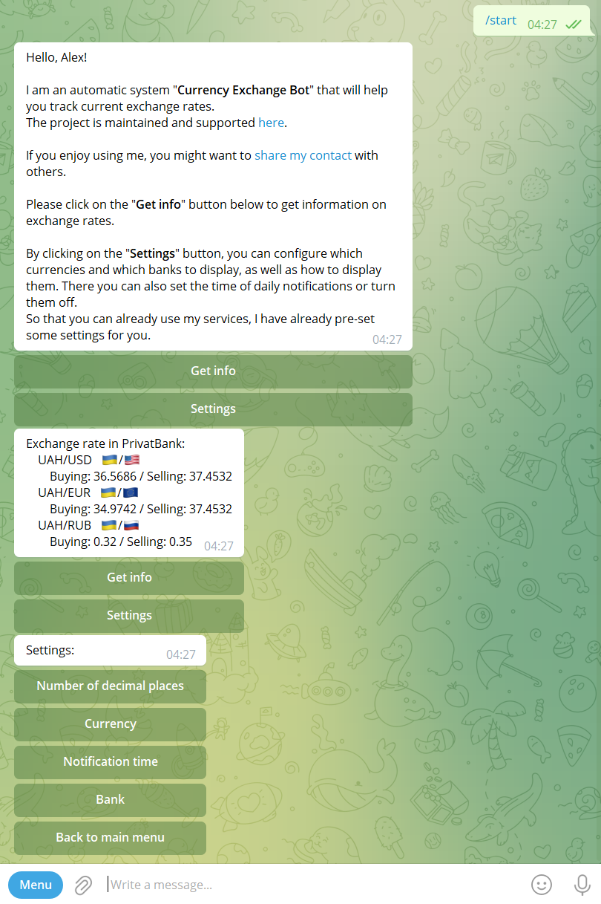

# Currency Exchange (telegram-bot)

Telegram bot application for obtaining exchange rates of three Ukrainian banks using their API ([National Bank of Ukraine](https://bank.gov.ua/en/markets/exchangerates), [PrivatBank](https://en.privatbank.ua/) and [Monobank](https://www.monobank.ua/?lang=en)) and displaying this information to the User in Telegram.

## Prerequisites

* Installed Java 14
* Telegram bot token

## How to build

1. Create Telegram bot (e.g. with help of [@BotFather](https://t.me/BotFather)) and obtain token.
1. Add this token to `bot.token` property in `src/main/resources/application.properties` file.
1. Use `./gradlew fatJar` command in terminal to generate Java archive file with dependencies. Jar file will be created in `build/libs` folder.

## How to run

In terminal in projects root use `java -jar ./build/libs/CurrencyExchange-TelegramBot-all-1.0-SNAPSHOT.jar` command. Application will start.

To terminate application use `Ctrl + C` shotrkey.